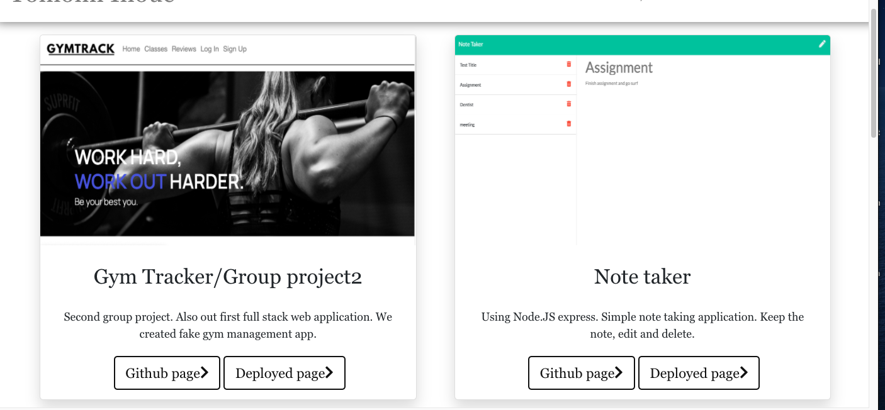
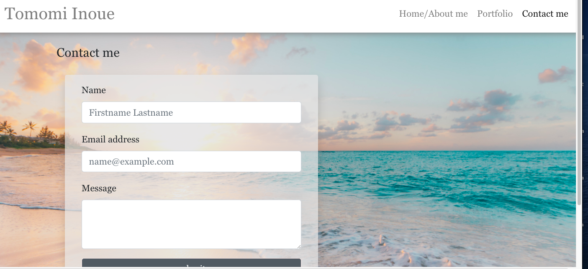

# React-Portfolio-Page
<h3>Homework_week20</h3>

<!-- TABLE OF CONTENTS -->

  
Table of Contents

  <ol>
    <li>
      <a href="#about-the-project">About The Project</a>
    </li>
    <li><a href="#Technology">Technology</a></li>
    <li><a href="#learning">Learning</a></li>
    <li><a href="#screenshots">Screen shots</a></li>
    <li><a href="#contact">Contact</a></li>
  </ol>

<!-- ABOUT THE PROJECT -->
## About The Project
Using React to update my portfolio page

## Technology

Major framework I used to create this application.

* [Javascript](https://www.javascript.com/)
* [React](https://reactjs.org/)
* [HTML]()
* [CSS]()

## Learning

Using React to update the portfolio page, it was bit confusing but also good practice to understand how to use components.
My Commit is very low because I initially create the react app to my original portfolio page and worked on it. 
This is I only created to deploy because I realized I can not deploy again. 

## Screenshots

* Home page

* Home page with scroll event

* Portfolio page

* Contact me

<!-- CONTACT -->
## Contact

Tomomi Inoue 
 

Project Link: [https://github.com/Chib1co/React-Portfolio-Page](https://github.com/Chib1co/React-Portfolio-Page)

Deployed page: [https://chib1co.github.io/](https://chib1co.github.io/)
